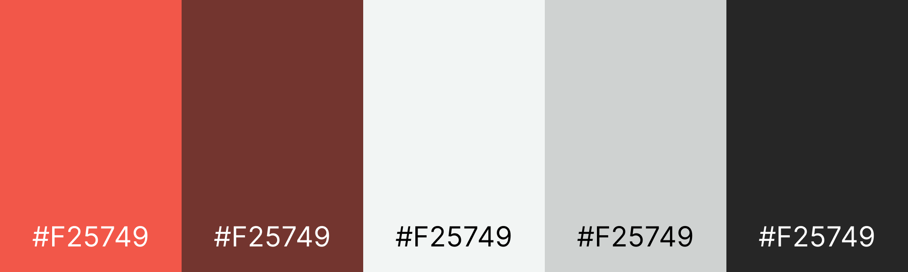

# Teste para estágio Frontend e Full-Stack (Finalizado)

> O projeto está visivel em [https://victorfreire7.github.io/teste-frontend-developer/frontend/](https://victorfreire7.github.io/teste-frontend-developer/frontend/). Mais abaixo no README, há também um modo de inicialização local do projeto.

## Visão Geral do Projeto

**Upscend** é uma landing page moderna e responsiva que apresenta uma solução inovadora em saúde e bem-estar: uma balança inteligente equipada com tecnologia de bioimpedância avançada.

## Motivação e Contexto Académico

Este tema foi escolhido com base em uma Iniciação Científica que realizei, onde estudei a criação de uma balança de bioimpedância. Esse conhecimento técnico e acadêmico proporcionou a base sólida para desenvolver uma landing page que não apenas apresenta o conceito, mas explora suas aplicações práticas.

## O que busquei no desenvolvimento do código

### Organização
- **Componentes Reutilizáveis**: CSS organizado com sistema de nomeação de classes de fácil entendimento e visualização
- **Documentação Inline**: Comentários explicativos em cada seção do código

### Otimização
- **Leveza**: Código CSS e JavaScript otimizado para carregamento rápido
- **Sem Dependências Desnecessárias**: Implementação pura com HTML5, CSS3 e JavaScript Vanilla
- **Eficiência de Renderização**: Seletores CSS otimizados e manipulação DOM

### Interatividade e UX
- **Animações Suaves**: Transições CSS de 0.2s e 0.3s para feedback visual
- **Scroll Smooth**: Navegação fluida com scroll suave no arquivo JS:

    ```
    return window.scroll({
        top: 0,
        left: 0,
        behavior: "smooth"
    });
    ```
- **Validação de Formulário**: Sistema que valida também no frontend todos os campos antes do envio

### Boas Práticas de Desenvolvimento
- **Validação Robusta**: Sistema de validação que impede envio com campos vazios
- **Semântica HTML5**: Uso apropriado de tags semânticas (`<header>`, `<article>`, `<section>`, `<footer>`)

### Identidade Visual
- **Dark & Light Balance**: Background dark (#262626) com acentos em terra-cotta (#73352F)
- **Tipografia Consistente**: Fonte Krona One em toda a interface para identidade visual
- **Contraste Otimizado**: Cores pensadas para legibilidade e impacto visual

</img>

---

## Modo de Inicialização

- **1º.** Realizar clone do projeto com digitando o seguinte comando no terminal:
    
    ```
    git clone https://github.com/victorfreire7/teste-frontend-developer.git
    ```

- **2º.** Abrir o arquivo 'index.html', dentro da pasta 'frontend' do repositório.

